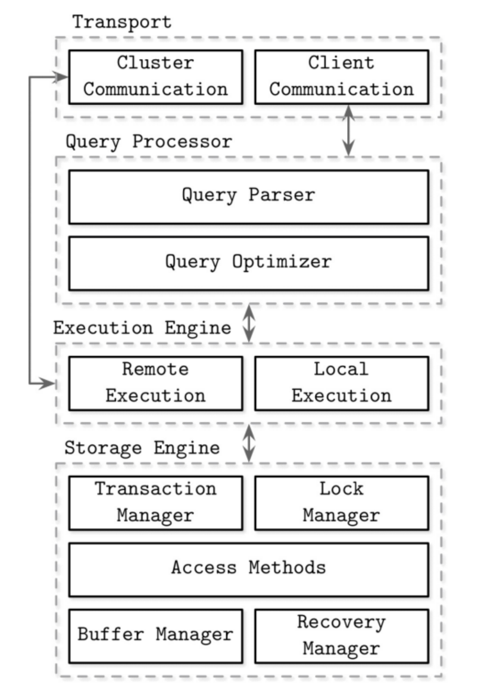

# 데이터베이스 (DB)
: 데이터가 구조화되어 모아져 있는 것.

DB 는 데이터를 모아놓은 덩어리이고, 이걸 관리하며 사용할 수 있도록 하는 게 **DBMS** 이다.

---

# 데이터베이스 관리 시스템 (DBMS : Database Management System)
: 데이터베이스를 생성하고 저장하고 관리하는 소프트웨어.

- 대표적인 DBMS : MySQL, Oracle, SQL server, MariaDB

---

# DBMS 의 유형
- 계층형(Hierarchical : HDBMS) : 트리 형태의 DB. 처음 DB를 구성하면 나중에 수정하기가 까다롭다. 하나의 데이터에서 다른 데이터로의 접근이 비효율적이다. 현재는 거의 사용되지 않지만 IBM의 IMS(Information Management System : IBM에서 개발한 계층형 DBMS + 트랜잭션 처리 시스템) 에서는 사용되고 있다.

> ## 트랜잭션
>
> : DB 에서 수행되는 논리적인 작업 단위를 말한다. A 라는 작업과 B 라는 작업이 논리적으로 함께 수행되어야 할 때(이 때 두 작업은 모두 성공하거나 모두 실패한다), A 와 B 를 하나의 트랜잭션으로 묶는다.
>
> **트랜잭션의 특징 (ACID)**
> |   |   |
> |---|---|
> | **A : Atomicity (원자성)** | 하나의 트랜잭션 속 작업들은 모두 성공하거나 모두 실패한다. |
> | **C : Consistency (일관성)** | 트랜잭션 수행 전/후 모든 데이터는 DB 의 무결성 제약을 만족하는 상태여야 한다. |
> | **I : Isolation (격리성)** | 동시에 실행되는 트랜잭션끼리는 서로 간섭하지 않는다. |
> | **D : Durability (지속성)** | 트랜잭션 성공 시, 그 결과는 영구적으로 반영되어야 한다. (전원이 꺼져도 남아 있어야 한다) |

- 망형(Network : NDBMS) : 계층형 DBMS의 단점을 보완한 모델로, 계층형 구조에서 하위계층의 데이터들이 서로 연결된 구조이다. 프로그래머가 모든 구조를 파악하고 있어야 하기 때문에 현재는 거의 쓰이지 않는다.

- 관계형(Relational : RDBMS) : 현재 MySQL 을 포함한 대부분의 DBMS 는 이 유형을 따른다. 한 개 이상의 행과 열로 이루어진 **테이블**로 데이터를 저장한다.

- 객체지향형(Object-Oriented : ODBMS)
- 객체관계형(Object-Relational : ORDBMS)

---

# SQL (Structured Query Language)
: 관계형 데이터 베이스를 조작하는데 사용되는 언어.

- 특정 회사에서 SQL 을 만드는게 아니라 국제표준화기구에서 SQL 에 대한 표준을 정해 발표하고 있는데, 이를 표준 SQL 이라고 한다.
- 표준이 있긴 하지만, DBMS 제작 회사는 SQL 표준을 준수하되, 자사의 DBMS 의 특성을 반영한 SQL 을 사용한다.
- 각 DBMS 가 사용하는 SQL이 기본적으로 표준 SQL 을 포함하고 있기 때문에, 표준 SQL을 배워두면 대부분의 DBMS에 적용할 수 있다.

---

데이터베이스에 관한 개념을 찾아보다가 **스키마** 라는 개념을 알게 되었다.

# 스키마 (Schema)
: 데이터베이스에 저장되는 데이터의 구조와 제약 조건 등을 정의한 것. 개체의 특성을 나타내는 속성과 속성들의 집합으로 이루어진 개체와 개체 사이에 존재하는 관계에 대한 정의, 그리고 개체들이 유지해야 할 제약 조건 등을 기술한 것.

스키마는 총 세 가지로 분류된다.

 외부 스키마 (서브 스키마)
- 사용자의 입장.
- 개별 사용자에게 DB를 어떻게 보여줄 것인지, 개별 사용자가 DB를 어떻게 다룰 것인지 등에 대한 정의.

- 하나의 DB에는 여러 개의 외부 스키마가 존재할 수 있다. 사용하려는 데이터가 동일한 사용자끼리 하나의 외부 스키마를 공유할 수 있다.

2) 개념 스키마
- 일반적으로 말하는 스키마.
- 전체적인 DB의 논리적인 구조에 대한 정의.
- 이 DB에 어떤 데이터가 저장되어 있는지, 데이터들 간의 관계는 어떤지, 보안이나 제약 조건은 어떻게 되는지 등을 정의.
- DB 당 하나만 존재한다.
- 데이터베이스 관리자 (DBA : Database Administrator) 에 의해 관리된다.

3) 내부 스키마
- DB가 물리적 저장 장치에 실제로 어떻게 저장되는지에 대한 정의.
- 개념 스키마를 어떻게 실제 기억 장치에 저장할 지에 대한 정의.
- 시스템 프로그래머에 의해서 주로 관리된다.

> **참고**
> 각 단계의 스키마는 서로 독립적이어서, 한 단계의 변경 사항이 다른 단계에 영향을 주지 않는다.

---

# 스토리지 엔진 (Storage Engine) = 데이터베이스 엔진
: DB의 데이터들을 CRUD(Create, Read, Update, Delete) 하게 해주는 것.

- 스토리지 엔진의 각 노드의 데이터는 영구적으로 저장된다. (트랜잭션이 성공적으로 커밋(commit) 된 이후의 데이터는 시스템이 꺼지거나 장애가 발생해도 손실되지 않는다는 의미.)

>
> ## DB 에서의 커밋(commit)
>
> : 트랜잭션에서 이루어진 모든 변경사항을 데이터베이스에 영구적으로 반영하라는 명령을 말한다.
>
> commit 이후에는 변경사항이 실제 물리적인 저장 장치(디스크)에 기록되어 전원이 꺼져도 손실되지 않는다.

- 스토리지 엔진이 여러 시스템에 유연하게 적용될 수 있도록 스토리지 엔진은 **직렬화된 바이트 데이터를** 다룬다.
  - (데이터들이 뭘 의미하는지는 모르고, 그냥 바이트 데이터들을 다룬다.)
  - 직렬화된 바이트 데이터들의 의미를 결정하는 건 DBMS 의 상위 요소들이다.
  - 데이터베이스가 복잡한 쿼리를 수행할 수 있도록 데이터를 세밀하게 조작할 수 있는 간단한 API 를 제공한다.
  - 스토리지 엔진에 따라 내부 스키마의 구현이 달라진다.
  - 스토리지 엔진도 이미 만들어진 것들이 존재하고, 가장 적합한 스토리지 엔진을 선택해서 사용하면 된다.

---

# 적합한 데이터베이스를 선택하는 올바른 방법
- 제공하는 컴포넌트, 인기 순위, 지원하는 언어를 기준으로 데이터베이스를 선택하는 건 올바르지 않을 수 있다.
- 먼저 데이터베이스의 목적을 명확히 하고, 실제 운영 환경과 최대한 비슷한 환경에서 오랫동안 테스트 해 본 뒤 가장 적합한 데이터베이스를 선택하는 것이 올바르다고 할 수 있다. 무조건 성능이 중요하다고는 할 수 없다.

---

> ## 핫 데이터, 웜 데이터, 콜드 데이터
>- 핫 데이터 : 매우 빈번하게 액세스되고 업데이트 되는 데이터. (예 : 주가 데이터)
>- 웜 데이터 : 핫 데이터보다는 덜 빈번하게 액세스되고 업데이트되는 데이터. (예 : 장바구니)
>- 콜드 데이터 : 거의 액세스되지 않는 데이터. (예 : 백업된 데이터)

# DBMS 의 구조
- DBMS 는 클라이언트/서버 모델을 기반으로 한다.
- 데이터베이스 인스턴스는 서버, 애플리케이션 인스턴스는 클라이언트이다.
- DBMS 에 대한 명확한 구조에 대한 정의는 없지만 일반적으로 아래와 같은 구조이다.

1) transport subsystem
: 클라이언트의 쿼리를 쿼리 프로세서에 전달한다. 데이터베이스 클러스터 노드 사이의 통신에도 사용된다.

2) query processor
: query parser - 쿼리의 해석, 분석, 검증을 담당한다. 쿼리를 분석해 query optimizer 에게 전달한다.
: query optimizer
- 가장 효율적인 쿼리 실행 계획(execution plan, query plan : 쿼리가 원하는 결과를 도출하기 위해 수행해야 하는 작업들)을 선택한다.
- 이때 internal statistics(index cardinality, intersection size) 와 data placement(데이터가 어디에 위치해 있는가)를 기준으로 가장 효율적인 query plan 을 찾는다.

---

# index cardinality
: 인덱스 컬럼에 존재하는 값들의 다양한 정도.
- 컬럼의 값들이 다양하면 index cardinality 가 높고, 컬럼의 값들이 다양하지 않다면 (중복도가 높다면) index cardinality 가 낮다.

**인덱스의 목적을 고려하면 index cardinality 가 높게 설정해야 한다.**

---

- 조인, 필터링, 그룹화 연산의 처리 순서를 결정한다.

> ## join
>
> : 여러 테이블이나 데이터베이스를 연결해서 데이터를 검색하는 방법을 말한다. 검색하려는 컬럼이 다른 테이블에 있는 경우에 주로 사용한다.

- dependency tree 를 그려서 연산 순서를 결정한다.

> ## dependency tree
>
> : 데이터의 처리 순서나 흐름을 나타낸 트리.
>
> "이걸 하려면, 먼저 이걸 해야한다." 를 나타낸 트리라고 보면 된다.

---

3) excution engine
: 선택된 실행 계획을 기반으로 쿼리를 처리한다. local operation(현재 DB 노드 안에서 수행되는 연산) 과 remote operation(다른 DB 노드에서 처리하는 연산)의 결과를 결합한다.

> ## local execution
>
> : storage engine 에 local query 를 넘겨서 실행하는 것. 쿼리를 하나의 노드에서 처리하는 실행을 말한다.
>
> ## remote execution
>
> : 쿼리를 처리하는데 필요한 데이터를 쿼리를 받은 노드가 전부 가지고 있지 않아서, 클러스터의 다른 노드에게 요청을 해야하는 실행을 말한다.

---

4) storage engin (= database engine)
: local query 를 수행한다. DBMS 가 쿼리를 받았을 때, 실제로 데이터를 건드리는 단계.

> ## local query, remote query
>
> - local query : 쿼리를 날린 현재 DB 노드에서 결과를 낼 수 있는 쿼리.
> - remote query : 쿼리를 날린 현재 DB 노드 혼자서는 처리할 수 없고, 다른 DB 노드에게 데이터를 요청해야 하는 쿼리.

---

storage engin 은 아래의 요소로 구성된다.

- transaction manager : 트랜잭션을 전체적으로 관리한다. ACID 중 consistency 유지에 기여한다.
- lock manager : 여러 트랜잭션이 같은 데이터를 동시에 건드리지 못하게 lock 을 걸어 제어한다. ACID 중 isolation 유지에 기여한다.
- access methods : 디스크에 정의된 데이터에 접근하는 방식을 정의하고, 레코드나 페이지 단위로 데이터를 읽고 쓰는 기능을 제공한다. Heap file, B-Tree, LSM Tree 가 이에 해당한다.

> ## record, page
>
> : 데이터의 단위들
>
> - record : 테이블의 한 행
> - page : 레코드의 묶음. 디스크의 데이터를 읽고 쓰는 단위는 페이지로 고정되어 있다.

- buffer manager : 자주 접근되는 디스크의 데이터를 메모리(정확히는 메모리 안의 특정 공간인 buffer pool)에 캐시한다.
- recovery manager : 트랜잭션 로그(redo/undo)를 기반으로 장애 발생 시 시스템을 일관된 상태로 복구한다.
  - 예) 서버가 꺼진 후 다시 켜졌을 때, 커밋된 트랜잭션은 다시 반영(Redo), 미완료 트랜잭션은 되돌리기(Undo)

---

# memory-based DBMS
- 데이터를 메모리에 저장한다.
- 복구 및 로그 저장 용도로 디스크를 사용한다.
- RAM 이 비싸고, 휘발성이기 때문에 데이터의 지속성을 보장하기 위해 추가적인 하드웨어 장치가 필요하다.
- 하지만 디스크보다 데이터 접근 속도가 빠르며 데이터에 접근하는데 드는 비용이 적다.
- 디스크보다 메모리가 성능이 좋고, 세밀한 단위로 데이터에 접근할 수 있다.
- 메모리 제어가 디스크 제어보다 프로그래밍적으로 더 간단하다.
- 위드 단위로 데이터를 읽으므로 page 단위로 데이터를 읽고 쓰는 디스크에 비해 access granularity(접근 단위의 세분성) 이 좋다.
- os 가 메모리 관리를 추상화하여 제공하므로 사용하는 간단한 작업으로 메모리를 제어할 수 있다.

---

# disk-based DBMS
- 데이터를 디스크에 저장한다.
- 데이터 캐싱과 임시 저장 용도로 메모리를 사용한다.
- RAM 보다 디스크가 싸고, 유지 관리 비용이 메모리에 비해 적다.
- 하지만 데이터 접근 방식이 까다롭고, 프로그래머가 조작해야하는 요소들이 많다.

---

# memory 기반의 DBMS 에서 durability 를 위한 방안들
- 디스크에 데이터를 백업한다.
- Write Ahead Logging (WAL) : "앞단 로그에 적어." 모든 변경 사항을 적용하기 전에 먼저 로그에 기록한다.
  - 연산이 완료되면 메모리에 기록하고 로그 파일에도 기록해야 한다.
- Backup Copy : 데이터 손실, 장애가 발생했을 때, 데이터를 복구하기 위해 특정 시점의 데이터베이스의 전체 또는 일부의 스냅샷을 저장해놓는 것을 말한다.

---

Q. 디스크에 데이터를 백업 vs. Backup Copy 뭐가 다르냐.
A. 백업은 주기적으로 메모리의 데이터를 기록하는 것을 말하고, backup copy 는 특정 시점의 메모리의 상태를 스냅샷 형태로 기록하는 것을 말한다. 백업은 하나의 파일이 수정되면서 이루어지지만, backup copy 는 각각의 시점의 스냅샷이 별도의 파일에 저장된다.
